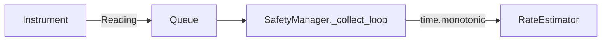
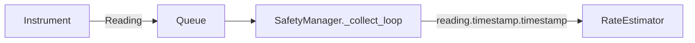

### F23: RateEstimator Measurement Timestamp Fix Specification

---

#### §0 Mandate
**Fix SafetyManager to pass the instrument measurement timestamp (`reading.timestamp.timestamp()`) to `RateEstimator.push()`** instead of the dequeue time (`time.monotonic()`). This ensures rate calculations reflect actual measurement timing, not processing delays.

---

#### §1 Scope
**In Scope:**
- Modify `SafetyManager._collect_loop` to use `reading.timestamp.timestamp()` for Kelvin readings.
- Unit tests validating timestamp correctness and edge cases.

**Out of Scope:**
- Changes to `RateEstimator` logic (e.g., buffer pruning).
- Handling of non-UTC timestamps or timezone conversions (assumes UTC).
- Modifications to the `Reading` dataclass.

---

#### §2 Architecture
**Current State:**

*Flaw:* `RateEstimator` uses dequeue time (`now`) for Kelvin readings, skewing rate calculations if queuing delays occur.

**Target State:**

*Fix:* `RateEstimator` receives the original measurement timestamp from `Reading.timestamp`.

---

#### §3 Implementation
**File:** `core/safety_manager.py`  
**Change:**  
Replace `now` with `reading.timestamp.timestamp()` for `RateEstimator.push()`:
```python
async def _collect_loop(self) -> None:
    assert self._queue is not None
    try:
        while True:
            reading = await self._queue.get()
            now = time.monotonic()
            self._latest[reading.channel] = (now, reading.value, reading.status.value)
            if reading.unit == "K":
                # FIX: Use measurement time instead of dequeue time
                self._rate_estimator.push(reading.channel, reading.timestamp.timestamp(), reading.value)  # CHANGED
    except asyncio.CancelledError:
        return
```
**Critical Notes:**
- `reading.timestamp` is UTC `datetime`. `.timestamp()` converts it to a POSIX timestamp (float).
- `now` is retained for `_latest` (monitors processing freshness).

---

#### §4 Acceptance Criteria
1. **Correct Timestamp Propagation:**  
   `RateEstimator.push()` receives `reading.timestamp.timestamp()`, not `time.monotonic()`, for Kelvin readings.

2. **Non-Kelvin Exclusion:**  
   Non-Kelvin readings (`unit != "K"`) are **not** passed to `RateEstimator`.

3. **UTC Conversion:**  
   `reading.timestamp.timestamp()` is used (validates UTC → float conversion).

4. **Late/Future Readings:**  
   Readings with timestamps:
   - Older than `RateEstimator`'s window are pruned (no errors).
   - Mildly future-dated (< 5s) are accepted (buffer tolerance).

5. **Clock Skew Resilience:**  
   No failures if system clock drifts vs. measurement clock (e.g., timestamp 24h in past/future).

---

#### §5 Tests
**Test File:** `tests/core/test_safety_manager.py`  
**Mock Objects:**  
- `Reading` with controllable `timestamp`, `unit`, `value`.  
- Patched `RateEstimator.push()`.

| Test Case                        | Inputs                          | Verification                                  |
|----------------------------------|---------------------------------|----------------------------------------------|
| `test_kelvin_uses_measurement_time` | `unit="K"`, `timestamp=datetime(2023, 1, 1, tzinfo=timezone.utc)` | `push()` called with `timestamp.timestamp() ≈ 1672531200.0` |
| `test_non_kelvin_ignored`        | `unit="V"`                      | `push()` not called                          |
| `test_old_reading_pruned`        | `timestamp = now - 600s` (window=300s) | RateEstimator buffer discards point post-push |
| `test_future_reading_handled`    | `timestamp = now + 2.0s`        | `push()` called, buffer retains point        |
| `test_high_clock_skew`           | `timestamp = now + 86400s` (1d future) | No crash; point pushed                       |

**Edge Case:**  
- `reading.timestamp` with `tzinfo=None` → treated as UTC (Python default).

---

#### §6 Phases
1. **Dev Phase (1 day):**  
   - Implement code change.  
   - Write unit tests.  
2. **Code Review (4h):**  
   - Review for timestamp correctness and test coverage.  
3. **QA Phase (4h):**  
   - Run unit tests + integration tests.  
   - Validate against hardware simulator (with induced queue delays).  
4. **Deployment:**  
   - Merge into `main` during scheduled release.  

---

#### §7 Hard Stops
- **Code Change Size:** ≤ 3 lines.  
- **Test Coverage:** 100% for modified code.  
- **Clock Skew:** Must not crash for timestamps ±30d from system time.  
- **Backward Compatibility:** No API/behavior changes beyond timestamp fix.  
- **Deadline:** Merge by 2023-10-15.  

--- 

**RISKS:**  
- Future timestamp accumulation in `RateEstimator` buffers (monitor via metrics).  
- Timezone-naive `datetime` in `Reading` (assume UTC per background).  
**MITIGATION:**  
Add log warning if `reading.timestamp` is >5s future-dated.
