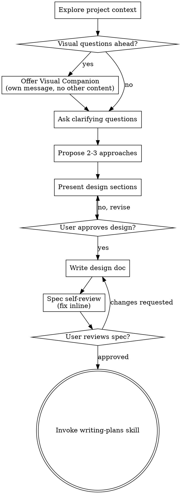

Reading prompt from stdin...
OpenAI Codex v0.124.0 (research preview)
--------
workdir: /Users/vladimir/Projects/cryodaq
model: gpt-5.5
provider: openai
approval: never
sandbox: workspace-write [workdir, /tmp, $TMPDIR, /Users/vladimir/.codex/memories]
reasoning effort: high
reasoning summaries: none
session id: 019dd581-f096-7270-8285-c74a642a6e5a
--------
user
# Code Generation — Hypothetical update_target() SCPI Write

This is exploratory — DO NOT actually recommend merging this.

Current update_target() uses delayed-update design: sets runtime.p_target,
trusts the P=const regulation loop to pick it up on next poll cycle (≤1s).

Hypothetical: add direct SCPI write to update_target() so hardware responds
immediately, BUT preserve all safety properties (slew-rate limiting,
compliance checks). Show how you would implement this.

## Reference materials

```python
# Current update_target() body (safety_manager.py:430)
async def update_target(self, p_target: float, *, channel: str | None = None) -> dict[str, Any]:
    """Live-update P_target on an active channel. Validates against config limits.
    [Delayed-update design — hardware updates on next poll cycle via P=const loop]
    """
    async with self._cmd_lock:
        smu_channel = normalize_smu_channel(channel)
        if self._state == SafetyState.FAULT_LATCHED:
            return {"ok": False, "error": f"FAULT: {self._fault_reason}"}
        if smu_channel not in self._active_sources:
            return {"ok": False, "error": f"Channel {smu_channel} not active"}
        if p_target <= 0:
            return {"ok": False, "error": "p_target must be > 0"}
        if p_target > self._config.max_power_w:
            return {"ok": False, "error": f"P={p_target}W exceeds limit"}
        if self._keithley is None:
            return {"ok": False, "error": "Keithley not connected"}
        runtime = self._keithley._channels.get(smu_channel)
        if runtime is None or not runtime.active:
            return {"ok": False, "error": f"Channel {smu_channel} not active on instrument"}
        old_p = runtime.p_target
        runtime.p_target = p_target
        logger.info("SAFETY: P_target update %s: %.4f → %.4f W", smu_channel, old_p, p_target)
        return {"ok": True, "channel": smu_channel, "p_target": p_target}

# start_source() pattern (keithley_2604b.py:223) — sets initial levelv=0
async def start_source(self, channel, p_target, v_compliance, i_compliance):
    smu_channel = normalize_smu_channel(channel)
    runtime = self._channels[smu_channel]
    runtime.p_target = p_target
    # ... configure SMU ...
    await self._transport.write(f"{smu_channel}.source.levelv = 0")  # starts at 0
    self._last_v[smu_channel] = 0.0
    runtime.active = True

# P=const regulation loop (keithley_2604b.py read_channels)
MAX_DELTA_V_PER_STEP = 0.5  # V — slew rate limit
# Called every poll cycle:
if abs(current) > _I_MIN_A and resistance > 0:
    target_v = math.sqrt(runtime.p_target * resistance)
    target_v = max(0.0, min(target_v, runtime.v_comp))
    current_v = self._last_v[smu_channel]
    delta_v = target_v - current_v
    if abs(delta_v) > MAX_DELTA_V_PER_STEP:
        delta_v = MAX_DELTA_V_PER_STEP if delta_v > 0 else -MAX_DELTA_V_PER_STEP
        target_v = current_v + delta_v
    await self._transport.write(f"{smu_channel}.source.levelv = {target_v}")
    self._last_v[smu_channel] = target_v
```

## Output format
Full method body in Python (update_target + any helpers needed).
Then 3-5 sentences on design choices and tradeoffs vs the delayed-update approach.

Key constraints your implementation must satisfy:
1. Must respect MAX_DELTA_V_PER_STEP = 0.5 V slew limit
2. Must not bypass compliance checks (v_comp, i_comp)
3. Must not break the P=const loop on next cycle
4. Must work with the existing _last_v tracking

Hard cap 1500 words. No preamble.

exec
/opt/homebrew/bin/bash -lc "sed -n '1,220p' /Users/vladimir/.codex/plugins/cache/openai-curated/superpowers/6807e4de4d8ceceefb51abd9e4ba3269030352c4/skills/using-superpowers/SKILL.md" in /Users/vladimir/Projects/cryodaq
 succeeded in 0ms:
---
name: using-superpowers
description: Use when starting any conversation - establishes how to find and use skills, requiring Skill tool invocation before ANY response including clarifying questions
---

<SUBAGENT-STOP>
If you were dispatched as a subagent to execute a specific task, skip this skill.
</SUBAGENT-STOP>

<EXTREMELY-IMPORTANT>
If you think there is even a 1% chance a skill might apply to what you are doing, you ABSOLUTELY MUST invoke the skill.

IF A SKILL APPLIES TO YOUR TASK, YOU DO NOT HAVE A CHOICE. YOU MUST USE IT.

This is not negotiable. This is not optional. You cannot rationalize your way out of this.
</EXTREMELY-IMPORTANT>

## Instruction Priority

Superpowers skills override default system prompt behavior, but **user instructions always take precedence**:

1. **User's explicit instructions** (CLAUDE.md, GEMINI.md, AGENTS.md, direct requests) — highest priority
2. **Superpowers skills** — override default system behavior where they conflict
3. **Default system prompt** — lowest priority

If CLAUDE.md, GEMINI.md, or AGENTS.md says "don't use TDD" and a skill says "always use TDD," follow the user's instructions. The user is in control.

## How to Access Skills

**In Claude Code:** Use the `Skill` tool. When you invoke a skill, its content is loaded and presented to you—follow it directly. Never use the Read tool on skill files.

**In Copilot CLI:** Use the `skill` tool. Skills are auto-discovered from installed plugins. The `skill` tool works the same as Claude Code's `Skill` tool.

**In Gemini CLI:** Skills activate via the `activate_skill` tool. Gemini loads skill metadata at session start and activates the full content on demand.

**In other environments:** Check your platform's documentation for how skills are loaded.

## Platform Adaptation

Skills use Claude Code tool names. Non-CC platforms: see `references/copilot-tools.md` (Copilot CLI), `references/codex-tools.md` (Codex) for tool equivalents. Gemini CLI users get the tool mapping loaded automatically via GEMINI.md.

# Using Skills

## The Rule

**Invoke relevant or requested skills BEFORE any response or action.** Even a 1% chance a skill might apply means that you should invoke the skill to check. If an invoked skill turns out to be wrong for the situation, you don't need to use it.


## Red Flags

These thoughts mean STOP—you're rationalizing:

| Thought | Reality |
|---------|---------|
| "This is just a simple question" | Questions are tasks. Check for skills. |
| "I need more context first" | Skill check comes BEFORE clarifying questions. |
| "Let me explore the codebase first" | Skills tell you HOW to explore. Check first. |
| "I can check git/files quickly" | Files lack conversation context. Check for skills. |
| "Let me gather information first" | Skills tell you HOW to gather information. |
| "This doesn't need a formal skill" | If a skill exists, use it. |
| "I remember this skill" | Skills evolve. Read current version. |
| "This doesn't count as a task" | Action = task. Check for skills. |
| "The skill is overkill" | Simple things become complex. Use it. |
| "I'll just do this one thing first" | Check BEFORE doing anything. |
| "This feels productive" | Undisciplined action wastes time. Skills prevent this. |
| "I know what that means" | Knowing the concept ≠ using the skill. Invoke it. |

## Skill Priority

When multiple skills could apply, use this order:

1. **Process skills first** (brainstorming, debugging) - these determine HOW to approach the task
2. **Implementation skills second** (frontend-design, mcp-builder) - these guide execution

"Let's build X" → brainstorming first, then implementation skills.
"Fix this bug" → debugging first, then domain-specific skills.

## Skill Types

**Rigid** (TDD, debugging): Follow exactly. Don't adapt away discipline.

**Flexible** (patterns): Adapt principles to context.

The skill itself tells you which.

## User Instructions

Instructions say WHAT, not HOW. "Add X" or "Fix Y" doesn't mean skip workflows.

exec
/opt/homebrew/bin/bash -lc "sed -n '1,220p' /Users/vladimir/.codex/plugins/cache/openai-curated/superpowers/6807e4de4d8ceceefb51abd9e4ba3269030352c4/skills/brainstorming/SKILL.md" in /Users/vladimir/Projects/cryodaq
 succeeded in 0ms:
---
name: brainstorming
description: "You MUST use this before any creative work - creating features, building components, adding functionality, or modifying behavior. Explores user intent, requirements and design before implementation."
---

# Brainstorming Ideas Into Designs

Help turn ideas into fully formed designs and specs through natural collaborative dialogue.

Start by understanding the current project context, then ask questions one at a time to refine the idea. Once you understand what you're building, present the design and get user approval.

<HARD-GATE>
Do NOT invoke any implementation skill, write any code, scaffold any project, or take any implementation action until you have presented a design and the user has approved it. This applies to EVERY project regardless of perceived simplicity.
</HARD-GATE>

## Anti-Pattern: "This Is Too Simple To Need A Design"

Every project goes through this process. A todo list, a single-function utility, a config change — all of them. "Simple" projects are where unexamined assumptions cause the most wasted work. The design can be short (a few sentences for truly simple projects), but you MUST present it and get approval.

## Checklist

You MUST create a task for each of these items and complete them in order:

1. **Explore project context** — check files, docs, recent commits
2. **Offer visual companion** (if topic will involve visual questions) — this is its own message, not combined with a clarifying question. See the Visual Companion section below.
3. **Ask clarifying questions** — one at a time, understand purpose/constraints/success criteria
4. **Propose 2-3 approaches** — with trade-offs and your recommendation
5. **Present design** — in sections scaled to their complexity, get user approval after each section
6. **Write design doc** — save to `docs/superpowers/specs/YYYY-MM-DD-<topic>-design.md` and commit
7. **Spec self-review** — quick inline check for placeholders, contradictions, ambiguity, scope (see below)
8. **User reviews written spec** — ask user to review the spec file before proceeding
9. **Transition to implementation** — invoke writing-plans skill to create implementation plan

## Process Flow



**The terminal state is invoking writing-plans.** Do NOT invoke frontend-design, mcp-builder, or any other implementation skill. The ONLY skill you invoke after brainstorming is writing-plans.

## The Process

**Understanding the idea:**

- Check out the current project state first (files, docs, recent commits)
- Before asking detailed questions, assess scope: if the request describes multiple independent subsystems (e.g., "build a platform with chat, file storage, billing, and analytics"), flag this immediately. Don't spend questions refining details of a project that needs to be decomposed first.
- If the project is too large for a single spec, help the user decompose into sub-projects: what are the independent pieces, how do they relate, what order should they be built? Then brainstorm the first sub-project through the normal design flow. Each sub-project gets its own spec → plan → implementation cycle.
- For appropriately-scoped projects, ask questions one at a time to refine the idea
- Prefer multiple choice questions when possible, but open-ended is fine too
- Only one question per message - if a topic needs more exploration, break it into multiple questions
- Focus on understanding: purpose, constraints, success criteria

**Exploring approaches:**

- Propose 2-3 different approaches with trade-offs
- Present options conversationally with your recommendation and reasoning
- Lead with your recommended option and explain why

**Presenting the design:**

- Once you believe you understand what you're building, present the design
- Scale each section to its complexity: a few sentences if straightforward, up to 200-300 words if nuanced
- Ask after each section whether it looks right so far
- Cover: architecture, components, data flow, error handling, testing
- Be ready to go back and clarify if something doesn't make sense

**Design for isolation and clarity:**

- Break the system into smaller units that each have one clear purpose, communicate through well-defined interfaces, and can be understood and tested independently
- For each unit, you should be able to answer: what does it do, how do you use it, and what does it depend on?
- Can someone understand what a unit does without reading its internals? Can you change the internals without breaking consumers? If not, the boundaries need work.
- Smaller, well-bounded units are also easier for you to work with - you reason better about code you can hold in context at once, and your edits are more reliable when files are focused. When a file grows large, that's often a signal that it's doing too much.

**Working in existing codebases:**

- Explore the current structure before proposing changes. Follow existing patterns.
- Where existing code has problems that affect the work (e.g., a file that's grown too large, unclear boundaries, tangled responsibilities), include targeted improvements as part of the design - the way a good developer improves code they're working in.
- Don't propose unrelated refactoring. Stay focused on what serves the current goal.

## After the Design

**Documentation:**

- Write the validated design (spec) to `docs/superpowers/specs/YYYY-MM-DD-<topic>-design.md`
  - (User preferences for spec location override this default)
- Use elements-of-style:writing-clearly-and-concisely skill if available
- Commit the design document to git

**Spec Self-Review:**
After writing the spec document, look at it with fresh eyes:

1. **Placeholder scan:** Any "TBD", "TODO", incomplete sections, or vague requirements? Fix them.
2. **Internal consistency:** Do any sections contradict each other? Does the architecture match the feature descriptions?
3. **Scope check:** Is this focused enough for a single implementation plan, or does it need decomposition?
4. **Ambiguity check:** Could any requirement be interpreted two different ways? If so, pick one and make it explicit.

Fix any issues inline. No need to re-review — just fix and move on.

**User Review Gate:**
After the spec review loop passes, ask the user to review the written spec before proceeding:

> "Spec written and committed to `<path>`. Please review it and let me know if you want to make any changes before we start writing out the implementation plan."

Wait for the user's response. If they request changes, make them and re-run the spec review loop. Only proceed once the user approves.

**Implementation:**

- Invoke the writing-plans skill to create a detailed implementation plan
- Do NOT invoke any other skill. writing-plans is the next step.

## Key Principles

- **One question at a time** - Don't overwhelm with multiple questions
- **Multiple choice preferred** - Easier to answer than open-ended when possible
- **YAGNI ruthlessly** - Remove unnecessary features from all designs
- **Explore alternatives** - Always propose 2-3 approaches before settling
- **Incremental validation** - Present design, get approval before moving on
- **Be flexible** - Go back and clarify when something doesn't make sense

## Visual Companion

A browser-based companion for showing mockups, diagrams, and visual options during brainstorming. Available as a tool — not a mode. Accepting the companion means it's available for questions that benefit from visual treatment; it does NOT mean every question goes through the browser.

**Offering the companion:** When you anticipate that upcoming questions will involve visual content (mockups, layouts, diagrams), offer it once for consent:
> "Some of what we're working on might be easier to explain if I can show it to you in a web browser. I can put together mockups, diagrams, comparisons, and other visuals as we go. This feature is still new and can be token-intensive. Want to try it? (Requires opening a local URL)"

**This offer MUST be its own message.** Do not combine it with clarifying questions, context summaries, or any other content. The message should contain ONLY the offer above and nothing else. Wait for the user's response before continuing. If they decline, proceed with text-only brainstorming.

**Per-question decision:** Even after the user accepts, decide FOR EACH QUESTION whether to use the browser or the terminal. The test: **would the user understand this better by seeing it than reading it?**

- **Use the browser** for content that IS visual — mockups, wireframes, layout comparisons, architecture diagrams, side-by-side visual designs
- **Use the terminal** for content that is text — requirements questions, conceptual choices, tradeoff lists, A/B/C/D text options, scope decisions

A question about a UI topic is not automatically a visual question. "What does personality mean in this context?" is a conceptual question — use the terminal. "Which wizard layout works better?" is a visual question — use the browser.

If they agree to the companion, read the detailed guide before proceeding:
`skills/brainstorming/visual-companion.md`

codex
```python
MAX_DELTA_V_PER_STEP = 0.5  # V


async def update_target(self, p_target: float, *, channel: str | None = None) -> dict[str, Any]:
    """Live-update P_target on an active channel and immediately apply one safe slew step."""
    async with self._cmd_lock:
        smu_channel = normalize_smu_channel(channel)

        if self._state == SafetyState.FAULT_LATCHED:
            return {"ok": False, "error": f"FAULT: {self._fault_reason}"}
        if smu_channel not in self._active_sources:
            return {"ok": False, "error": f"Channel {smu_channel} not active"}
        if p_target <= 0:
            return {"ok": False, "error": "p_target must be > 0"}
        if p_target > self._config.max_power_w:
            return {"ok": False, "error": f"P={p_target}W exceeds limit"}
        if self._keithley is None:
            return {"ok": False, "error": "Keithley not connected"}

        runtime = self._keithley._channels.get(smu_channel)
        if runtime is None or not runtime.active:
            return {"ok": False, "error": f"Channel {smu_channel} not active on instrument"}

        old_p = runtime.p_target

        try:
            applied_v = await self._keithley.apply_p_target_step_now(
                smu_channel,
                p_target,
            )
        except ValueError as exc:
            return {"ok": False, "error": str(exc)}

        logger.info(
            "SAFETY: P_target update %s: %.4f -> %.4f W; applied levelv %.4f V",
            smu_channel,
            old_p,
            p_target,
            applied_v,
        )

        return {
            "ok": True,
            "channel": smu_channel,
            "p_target": p_target,
            "applied_v": applied_v,
        }


# Keithley_2604B helper. read_channels should use the same lock around its
# P=const write/update block so _last_v and source.levelv cannot diverge.
async def apply_p_target_step_now(self, channel: str, p_target: float) -> float:
    smu_channel = normalize_smu_channel(channel)
    runtime = self._channels.get(smu_channel)

    if runtime is None or not runtime.active:
        raise ValueError(f"Channel {smu_channel} not active on instrument")
    if p_target <= 0:
        raise ValueError("p_target must be > 0")
    if runtime.v_comp <= 0 or runtime.i_comp <= 0:
        raise ValueError(f"Channel {smu_channel} compliance limits are invalid")

    async with self._regulation_lock:
        reading = self._last_readings.get(smu_channel)
        if reading is None:
            runtime.p_target = p_target
            return self._last_v.get(smu_channel, 0.0)

        current = abs(reading.current_a)
        resistance = reading.resistance_ohm

        runtime.p_target = p_target

        if current <= _I_MIN_A or resistance <= 0:
            return self._last_v.get(smu_channel, 0.0)

        target_v = math.sqrt(p_target * resistance)

        # Preserve compliance behavior from the regulation loop.
        target_v = max(0.0, min(target_v, runtime.v_comp))

        # Optional explicit power-derived current guard. For a valid positive
        # resistance this is equivalent to V/R, but keeping it explicit prevents
        # this direct path from exceeding i_comp if the calculation changes later.
        target_i = target_v / resistance
        if target_i > runtime.i_comp:
            target_v = runtime.i_comp * resistance
            target_v = max(0.0, min(target_v, runtime.v_comp))

        current_v = self._last_v.get(smu_channel, 0.0)
        delta_v = target_v - current_v

        if abs(delta_v) > MAX_DELTA_V_PER_STEP:
            delta_v = MAX_DELTA_V_PER_STEP if delta_v > 0 else -MAX_DELTA_V_PER_STEP
            target_v = current_v + delta_v

        await self._transport.write(f"{smu_channel}.source.levelv = {target_v}")
        self._last_v[smu_channel] = target_v

        return target_v
```

This keeps `runtime.p_target` as the single source of truth, so the next P=const poll cycle continues from the same target instead of fighting the immediate write. The helper applies exactly one regulation step using the same `MAX_DELTA_V_PER_STEP` and updates `_last_v` after the SCPI write, preserving the driver’s tracking model. The direct path needs a recent cached reading; without one it should update only `p_target` and let the normal loop take over, because computing an immediate voltage without resistance/current context would weaken the safety model. The tradeoff is lower command latency at the cost of more coupling between `SafetyManager` and the Keithley regulation internals, plus a new locking requirement between this helper and `read_channels`.
tokens used
20 695
```python
MAX_DELTA_V_PER_STEP = 0.5  # V


async def update_target(self, p_target: float, *, channel: str | None = None) -> dict[str, Any]:
    """Live-update P_target on an active channel and immediately apply one safe slew step."""
    async with self._cmd_lock:
        smu_channel = normalize_smu_channel(channel)

        if self._state == SafetyState.FAULT_LATCHED:
            return {"ok": False, "error": f"FAULT: {self._fault_reason}"}
        if smu_channel not in self._active_sources:
            return {"ok": False, "error": f"Channel {smu_channel} not active"}
        if p_target <= 0:
            return {"ok": False, "error": "p_target must be > 0"}
        if p_target > self._config.max_power_w:
            return {"ok": False, "error": f"P={p_target}W exceeds limit"}
        if self._keithley is None:
            return {"ok": False, "error": "Keithley not connected"}

        runtime = self._keithley._channels.get(smu_channel)
        if runtime is None or not runtime.active:
            return {"ok": False, "error": f"Channel {smu_channel} not active on instrument"}

        old_p = runtime.p_target

        try:
            applied_v = await self._keithley.apply_p_target_step_now(
                smu_channel,
                p_target,
            )
        except ValueError as exc:
            return {"ok": False, "error": str(exc)}

        logger.info(
            "SAFETY: P_target update %s: %.4f -> %.4f W; applied levelv %.4f V",
            smu_channel,
            old_p,
            p_target,
            applied_v,
        )

        return {
            "ok": True,
            "channel": smu_channel,
            "p_target": p_target,
            "applied_v": applied_v,
        }


# Keithley_2604B helper. read_channels should use the same lock around its
# P=const write/update block so _last_v and source.levelv cannot diverge.
async def apply_p_target_step_now(self, channel: str, p_target: float) -> float:
    smu_channel = normalize_smu_channel(channel)
    runtime = self._channels.get(smu_channel)

    if runtime is None or not runtime.active:
        raise ValueError(f"Channel {smu_channel} not active on instrument")
    if p_target <= 0:
        raise ValueError("p_target must be > 0")
    if runtime.v_comp <= 0 or runtime.i_comp <= 0:
        raise ValueError(f"Channel {smu_channel} compliance limits are invalid")

    async with self._regulation_lock:
        reading = self._last_readings.get(smu_channel)
        if reading is None:
            runtime.p_target = p_target
            return self._last_v.get(smu_channel, 0.0)

        current = abs(reading.current_a)
        resistance = reading.resistance_ohm

        runtime.p_target = p_target

        if current <= _I_MIN_A or resistance <= 0:
            return self._last_v.get(smu_channel, 0.0)

        target_v = math.sqrt(p_target * resistance)

        # Preserve compliance behavior from the regulation loop.
        target_v = max(0.0, min(target_v, runtime.v_comp))

        # Optional explicit power-derived current guard. For a valid positive
        # resistance this is equivalent to V/R, but keeping it explicit prevents
        # this direct path from exceeding i_comp if the calculation changes later.
        target_i = target_v / resistance
        if target_i > runtime.i_comp:
            target_v = runtime.i_comp * resistance
            target_v = max(0.0, min(target_v, runtime.v_comp))

        current_v = self._last_v.get(smu_channel, 0.0)
        delta_v = target_v - current_v

        if abs(delta_v) > MAX_DELTA_V_PER_STEP:
            delta_v = MAX_DELTA_V_PER_STEP if delta_v > 0 else -MAX_DELTA_V_PER_STEP
            target_v = current_v + delta_v

        await self._transport.write(f"{smu_channel}.source.levelv = {target_v}")
        self._last_v[smu_channel] = target_v

        return target_v
```

This keeps `runtime.p_target` as the single source of truth, so the next P=const poll cycle continues from the same target instead of fighting the immediate write. The helper applies exactly one regulation step using the same `MAX_DELTA_V_PER_STEP` and updates `_last_v` after the SCPI write, preserving the driver’s tracking model. The direct path needs a recent cached reading; without one it should update only `p_target` and let the normal loop take over, because computing an immediate voltage without resistance/current context would weaken the safety model. The tradeoff is lower command latency at the cost of more coupling between `SafetyManager` and the Keithley regulation internals, plus a new locking requirement between this helper and `read_channels`.
