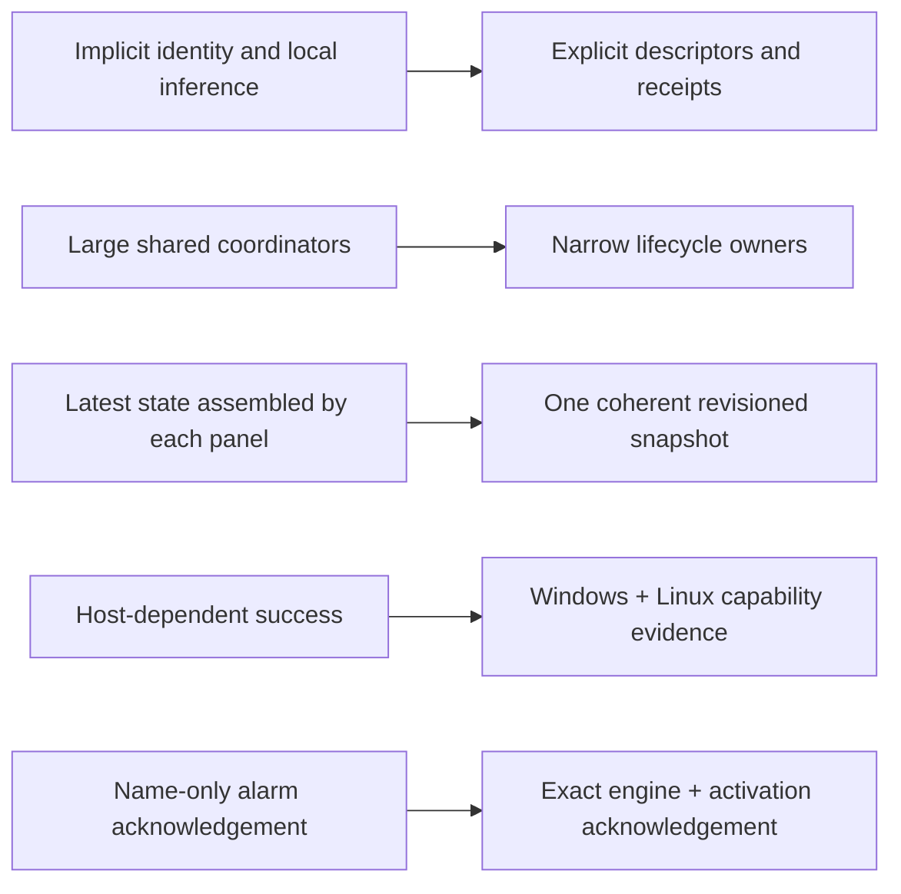
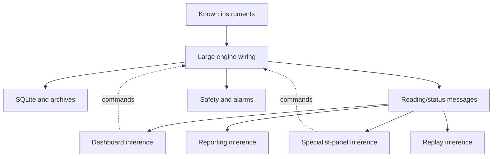
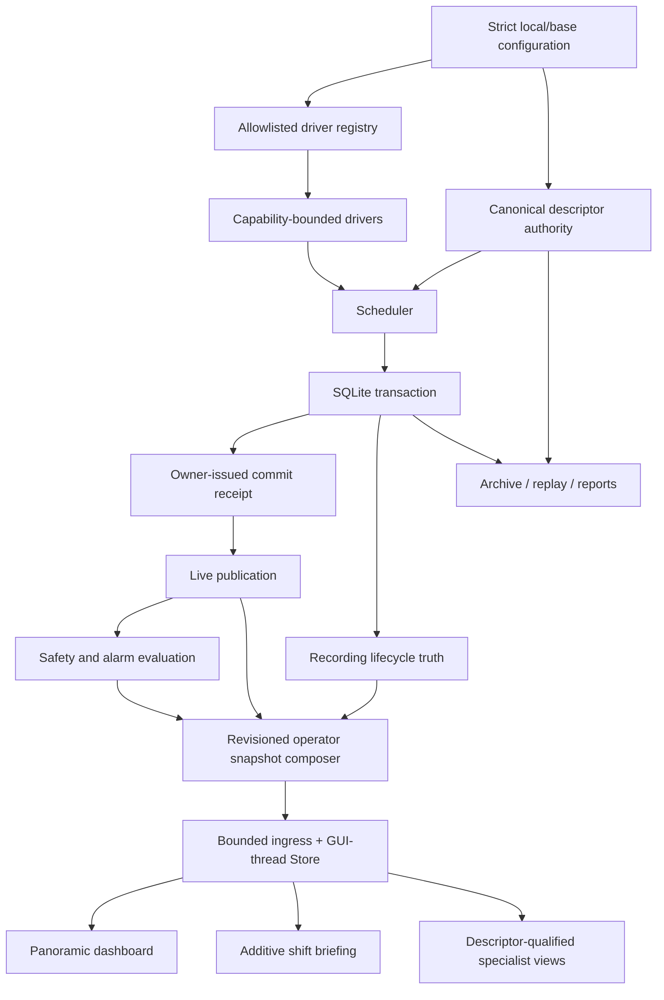
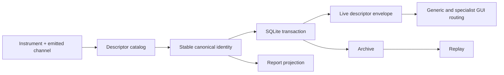

# CryoDAQ Montana Refactor: Full Engineering Report

**Document status:** living report for the `feat/montana-phase-a` campaign
**Comparison baseline:** pinned commit `f5d6434d20dffae62c9f03fbc12f68b03f48351b`
(CryoDAQ v0.64.1)
**Measurement target:** final candidate worktree immediately before sealing; tracked checkpoint `f5946b9` plus the explicitly owned final slice
**Report date:** 2026-07-16
**Audience:** cryogenic engineers, operators, maintainers, reviewers, and future extension authors

> **Evidence boundary.** This report describes a large software refactor and the
> evidence collected for it. It does **not** claim physical laboratory acceptance.
> Mock instruments, replay, source-mode runs, Windows or Linux CI, WSL, screenshots,
> and frozen-build tests cannot replace the real-Windows, dummy-load,
> independent-final-element, host-death, and physical-hardware procedures in
> [`lab_verification_checklist.md`](lab_verification_checklist.md). The measurements
> below describe the final candidate worktree immediately before sealing. Release
> evidence must record the exact Git/CI SHA externally after commit, because
> embedding that final identifier in this commit would be self-referential.

## Executive summary

Montana is not a cosmetic cleanup. It changes how CryoDAQ assigns authority,
preserves identity, publishes operator truth, contains failures, extends to new
instruments, creates reports, survives process restarts, and proves those
properties on both Windows and Linux.

The v0.64.1 baseline was already a substantial and useful laboratory application.
It acquired temperature, pressure, source, and interferometer data; persisted
readings; implemented a safety state machine and alarms; supported calibration,
analytics, replay, reports, a local GUI, an optional web surface, and an
observational assistant. Its strengths were real: broad hardware support,
operator visibility, an engine/GUI process boundary, a persistence-first intent,
and years' worth of experimental workflow encoded in one system.

Its principal problem was not lack of features. It was that too many important
properties were implicit, name-derived, locally reconstructed, or concentrated in
large coordinators. Instrument type switches and channel-name heuristics coupled
new hardware to central code. Several runtime responsibilities were owned by one
large engine function. GUI panels independently inferred state. Periodic reports
mixed scheduling, rendering, delivery, recovery, and process lifetime concerns.
Some tests passed on one host because they accidentally depended on POSIX file or
process semantics. A stale request could acknowledge a newly recurring alarm if
the API identified only the alarm rule name. A green dashboard could be visually
attractive yet still hide provenance, freshness, or the difference between
"known safe" and "not currently known."

Montana addresses those weaknesses through explicit contracts and single-owner
flows:

- stable channel descriptors replace semantic guesses from raw labels;
- a capability-bound driver registry replaces central model switches;
- persistence issues receipts, and only committed data is publishable truth;
- bounded spools and archive readers make failure and resource limits explicit;
- one revisioned operator snapshot carries a coherent cut of backend-owned truth;
- the GUI retains the panoramic, information-rich dashboard and uses the Primary
  Operator Display as an additive briefing, not a black-box replacement;
- safety, experiment recording, reporting, assistant, and soak lifecycles have
  explicit owners and settlement rules;
- periodic report rendering and delivery run behind bounded process and protocol
  boundaries;
- alarm acknowledgement targets an exact activation in an exact engine process;
- Windows, WSL, Linux, formatter, documentation-freshness, and sharded CI gates
  expose host assumptions rather than weakening production invariants;
- the design system is now an operator-safety contract as well as a visual system.

Measured from `f5d6434` to the candidate source inventory, the campaign changes
**489 files**, with **133,961 inserted lines** and **9,522 deleted lines**, or a
**net increase of 124,439 lines**. These figures are Git line-change statistics,
not "133,961 new production lines." The baseline repository had **188,539 text
lines**, including **68,857 lines of production Python** and **80,529 lines of test
Python**. The candidate source inventory has **312,978 text lines**, including
**111,809 production-Python lines** and **145,456 test-Python lines**.
Much of the growth is deliberate executable evidence: tests, fixtures, process
harnesses, protocol contracts, and documentation. These figures measure the final
candidate worktree immediately before sealing. Release evidence must record the
exact Git/CI SHA externally after commit because embedding it here is self-referential.

The central result is therefore not merely "more code." It is a shift from
distributed assumptions to reviewable authority:



Software closure is near, but release honesty matters: the final candidate still
needs its own sealed-SHA full test and eight-job CI result, and the documented
physical gates remain open until run on the prescribed equipment.

## 1. How to read this report

This document has four layers:

1. **The story:** what CryoDAQ was, why Montana was necessary, and what changed.
2. **The architecture:** authority, data, control, process, storage, GUI, and
   extension flows before and after the campaign.
3. **The evidence:** measured scale, tests, CI, platform work, review method, and
   known limitations.
4. **The inventory:** subsystem, important-file, commit-theme, migration, command,
   and glossary appendices for maintainers.

The four companion SVGs serve two different reading levels:

- [Baseline architecture — important files](refactor/architecture-before-important.svg)
- [Montana architecture — important files](refactor/architecture-montana-important.svg)
- [Baseline repository graph — all files](refactor/architecture-before-all-files.svg)
- [Montana repository graph — all files](refactor/architecture-montana-all-files.svg)

The important-file diagrams are intended for human discussion. The all-file
diagrams are dense engineering inventories: use zoom/search and treat visual
centrality as a coupling clue, not an automatic defect score.

## 2. The system before Montana

### 2.1 What the baseline already did well

Montana should not erase the engineering value of the baseline. Before this
campaign CryoDAQ already provided:

- a headless asynchronous engine separated from the restartable Qt GUI;
- LakeShore 218S, Keithley 2604B, Thyracont VSP63D, and Etalon MultiLine support;
- SQLite acquisition storage, Parquet/cold archive paths, CSV/XLSX exports, replay,
  and DOCX reporting;
- a six-state safety manager, verified-OFF discipline, interlocks, physical alarms,
  sensor diagnostics, rate checks, and operator emergency-off paths;
- calibration workflows, conductivity analytics, cooldown prediction, trend and
  cross-experiment analysis;
- a broad, information-dense dashboard that allowed an experienced operator to
  see many sensors and instruments at once;
- local ZeroMQ boundaries between the engine and GUI, and a loopback-oriented web
  monitoring surface;
- an observational assistant, Telegram notifications, and periodic reports;
- thousands of regression tests and a mature change history.

Those capabilities made the baseline operationally meaningful. The Montana goal
was to harden the foundations without degrading the two qualities the operator
explicitly values most: **information completeness** and **visual quality**.

### 2.2 Why the baseline had its shape

CryoDAQ grew rapidly around a single physical stand. Direct knowledge of the
stand—instrument models, raw channel labels, expected temperature positions,
source names, and operator workflows—was the fastest way to turn experimental
needs into working software. The resulting architecture was understandable in
the small: one engine wired everything, known labels selected known panels, and
individual views fetched what they needed.

That approach becomes fragile as the repository and number of supported workflows
grow. A rule that is obvious to one maintainer becomes an invisible precondition
to another. A new instrument can require edits across engine construction,
configuration, setup UI, packaging, storage, reporting, replay, and GUI routing.
A raw channel label can accidentally become both presentation text and semantic
identity. Multiple views can display different interpretations of the same instant.
One long-running function can own enough responsibilities that cancellation order
and error propagation become hard to reason about.

### 2.3 The main baseline weaknesses

The weaknesses were architectural rather than a claim that every old behavior was
wrong:

| Baseline pressure | Operational consequence |
|---|---|
| Central engine wiring knew concrete instrument models | Adding hardware risked broad edits and hidden coupling. |
| Channel semantics could be inferred from labels, prefixes, ranges, or vendor text | Renaming or replay could silently change routing and safety interpretation. |
| GUI panels reconstructed state independently | Freshness, provenance, and readiness could disagree across panels. |
| Large runtime functions owned many tasks | Startup, cancellation, restart, and failure settlement were difficult to test in isolation. |
| Periodic reporting crossed engine, assistant, renderer, delivery, and state-file concerns | Duplicate owners, crash recovery, and stale state were hard boundaries. |
| Platform behavior was often exercised primarily on POSIX-like hosts | Windows locks, replace semantics, symlink permissions, creation time, subprocess shutdown, and event loops exposed failures late. |
| Some unbounded reads/collections assumed ordinary data size | Corrupt or very large artifacts could consume excessive time or memory. |
| Alarm acknowledgement could identify a rule rather than one occurrence | A delayed click/request could affect a later recurrence. |
| The GUI redesign direction briefly over-compressed the home surface | An attractive summary risked becoming a black box when an unforeseen condition had no tile. |
| Design guidance mixed aesthetic and state semantics | Safety colors, experiment phase, measurement series, caution/warning, stale data, and accent could compete for meaning. |

### 2.4 Baseline flow in plain language

The baseline engine acquired readings and generally persisted before publication.
The GUI and analytical consumers then subscribed to readings and status streams.
However, many downstream components still had to answer semantic questions for
themselves: "which physical channel is this?", "is this instrument the one I
expect?", "does this green mean safe, active, or merely selected?", and "are these
values from the same revision?"



The engine remained the safety authority, but truth presentation and identity
resolution were not yet consistently expressed as narrow, reusable contracts.

## 3. Why Montana was undertaken

The campaign had five practical motivations.

### 3.1 Make laboratory behavior fail closed at boundaries

The system must never call an output safe merely because an OFF command was sent,
publish a reading that was not committed, infer a hazardous capability from duck
typing, or turn missing evidence into optimistic green. This required explicit
receipts, bounded queues, verified process identity, exact protocol schemas, and
conservative unavailable states.

### 3.2 Make extension possible without central rewiring

The next instrument should not require editing every layer of the system. Passive
instrument support needed an allowlisted registry, declared configuration schema,
capability protocols, stable channel descriptors, a conformance kit, frozen-build
inventory, and a reference extension that crosses acquisition through display.

### 3.3 Give the operator coherent truth without hiding the plant

The operator must be able to answer: can the run proceed, what is happening, what
needs attention, is recording real, is evidence stale, and what safe action comes
next? A coherent snapshot helps, but it cannot replace the panoramic overview.
Montana therefore converged on an additive model: the information-rich dashboard
remains primary, while a briefing/POD summarizes a consistent cut and specialist
views remain reachable.

### 3.4 Make asynchronous ownership reviewable

Long-running processes need one owner for startup, cancellation, replacement,
publication, and cleanup. Periodic reports, snapshot composition, recording state,
assistant runtime, and soak evidence were decomposed so their lifetime contracts
could be tested independently.

### 3.5 Make Windows a real target, not an afterthought

The lab runtime includes Windows-specific installation and packaging requirements.
WSL is useful as a Linux comparison but is not evidence for a Windows binary.
Montana used both platforms to identify hidden assumptions while keeping the
requirements distinct.

## 4. Scale and measurement methodology

### 4.1 What the line counts mean

The following table distinguishes three numbers that are easy to confuse:

| Measure | Value | Meaning |
|---|---:|---|
| Baseline production Python | 68,857 lines | Python under `src/cryodaq` at `f5d6434`. |
| Git insertions in the campaign | 133,961 lines | Lines added across the intended source inventory: tracked source plus the explicitly owned final additions, excluding the four generated architecture SVGs. Not all are net-new production code. |
| Git deletions in the campaign | 9,522 lines | Lines removed or replaced. |
| Net source-inventory growth | 124,439 lines | Insertions minus deletions. |
| Delivered-tree Git churn | 139,514 insertions / 9,522 deletions / 129,992 net | Source inventory plus the four regenerated architecture SVGs. |
| Baseline repository text | 188,539 lines | Measured text inventory across the baseline tree. |
| Candidate source-inventory text | 312,978 lines | Strict UTF-8/no-NUL text in the intended candidate inventory, excluding the four generated architecture SVGs. |
| Delivered-tree text | 318,531 lines | Final source inventory plus the four regenerated architecture SVGs. |
| Baseline test Python | 80,529 lines | Python under `tests`. |
| Candidate production Python | 111,809 lines | Candidate `src/cryodaq` inventory, not 133,961. |
| Candidate test Python | 145,456 lines | Candidate `tests` inventory. |
| Paths changed in candidate comparison | 489 | Baseline comparison plus explicitly intended final-candidate additions; generated architecture SVGs are excluded. |
| Paths changed in delivered comparison | 493 | Candidate comparison plus four generated architecture SVG paths. |
| Baseline repository files | 779 | Inventory at `f5d6434`. |
| Architecture source manifest | 1,035 | Every intended source file except the four self-referential generated `docs/refactor/architecture-*.svg` outputs. |
| Delivered-tree files | 1,039 | Source manifest plus the four regenerated architecture SVGs. |
| Commits from baseline to sealed checkpoint | 166 | Commit count including the final working slice. |

The repository added **42,952 lines of production Python** and **64,927
lines of test Python** by inventory. This is a healthier explanation of the
campaign than saying the project "added 130k lines of code": most growth is not
application logic alone, and test growth exceeds production growth.

### 4.2 Reproducible measurement approach

The final release owner should rerun the inventory against the sealed candidate:

```powershell
git rev-parse f5d6434d20dffae62c9f03fbc12f68b03f48351b
git rev-parse HEAD
git rev-list --count f5d6434d20dffae62c9f03fbc12f68b03f48351b..HEAD
git diff --shortstat f5d6434d20dffae62c9f03fbc12f68b03f48351b HEAD
git diff --numstat f5d6434d20dffae62c9f03fbc12f68b03f48351b HEAD
git diff --name-only f5d6434d20dffae62c9f03fbc12f68b03f48351b HEAD
rg --files src/cryodaq -g '*.py'
rg --files tests -g '*.py'
```

For the baseline inventory, read every blob named by `git ls-tree -r --name-only
<sha>`. For the candidate source inventory, take `git ls-files` plus the explicit
`INTENDED_ADDITIONS` tuple in the SVG generator. Exclude the four generated
architecture SVGs until their final regeneration; this avoids self-referential
source metrics. Count a file as text only when it contains no NUL byte and decodes
as strict UTF-8, and count lines with `splitlines()`. This method measured **767
text files and 12 binary files (3,878,632 bytes)** in the baseline, and **1,023
text files and the same 12 binary files** in the candidate source inventory.
Untracked test artifacts, caches, local outputs, and machine-local configuration
are not part of either inventory. Binary files and Git's `-` numstat entries must
be reported separately. The companion SVG generator records the pinned baseline
plus manifest and content fingerprints in its metadata. The candidate commit is
recorded in external exact-SHA CI evidence so generated files remain byte-stable
after they are committed.

### 4.3 Why so much code was added

The largest growth categories are:

1. deterministic test and process harnesses for lifecycle, crash, replay, and
   cross-platform boundaries;
2. new protocol/state/descriptor contracts rather than implicit dictionaries;
3. bounded archive, spool, report, and support-bundle implementations;
4. periodic-report subprocess, coordinator, state, delivery, and recovery layers;
5. operator snapshot models, stores, publication, replay, and GUI projections;
6. registry, capability, descriptor, reference-driver, and conformance machinery;
7. platform-specific CI evidence and soak runners;
8. design-system and operational documentation.

Large size is not itself proof of quality. Montana's quality claim rests on whether
the added code narrows authority, bounds resources, adds deterministic evidence,
and removes semantic guessing. Future maintenance should actively consolidate
duplicated harness helpers and keep new features from recreating central coupling.

## 5. The Montana architecture now

### 5.1 The governing rule: one authoritative owner

Montana's recurring design rule is that every important truth has one owner:

| Truth or action | Authoritative owner |
|---|---|
| Instrument construction | Allowlisted driver registry and validated config. |
| Channel identity | Complete descriptor manifest selected off-loop. |
| Persisted reading | SQLite transaction and owner-issued commit receipt. |
| Published live reading | Scheduler after persistence receipt. |
| Safety state | SafetyManager and its verified evidence. |
| Alarm activation | Alarm engine's activation record. |
| Alarm attention acknowledgement | Exact activation protocol; separate from safety recovery. |
| Experiment recording state | Recording lifecycle owner tied to committed SQLite epochs. |
| Operator snapshot revision | Durable allocator after a complete coherent cut validates. |
| GUI state mutation | GUI-thread Store fed by bounded ingress. |
| Periodic report schedule/recovery | Single coordinator and durable state contract. |
| Report rendering | Isolated child process with bounded input/output protocol. |
| Delivery state | Provider-neutral delivery state and strict sender adapter. |
| Soak evidence | Owned runner/registry and opaque receipts. |

This makes absence explicit. If the required owner cannot prove a fact, the result
is unavailable, stale, disconnected, not-recording, or fail-dark—not a fallback
writer, guessed identity, or optimistic status.

### 5.2 Current high-level flow



### 5.3 Trust boundaries

The architecture deliberately separates observational and controlling paths:

- the GUI is not the safety source of truth and never receives direct instrument
  access;
- the web surface is loopback-oriented and read-only except for exactly two
  authenticated, narrow write endpoints: operator log and exact alarm attention
  acknowledgement;
- the assistant may issue only allowlisted read-only queries and operator text;
- periodic PNG delivery is observational and cannot control instruments;
- passive driver extension capability does not imply source authority;
- source drivers require explicit reviewed safety adapters and verified-OFF
  contracts;
- health telemetry cannot start, stop, reset, vent, purge, or automatically
  remediate equipment;
- replay can reproduce observation but cannot create live authority;
- support bundles collect bounded, redacted evidence and cannot become fallback
  state writers.

## 6. Subsystem-by-subsystem account

### 6.1 Engine decomposition and lifecycle ownership

`src/cryodaq/engine.py` remains large because it is the composition root, but it
no longer has to implement every lifecycle internally. Its physical length changed
from **4,103 to 4,068 lines** across the measured comparison; more
importantly, the `_run_engine` body fell from approximately **1,945 to 1,011
lines**, and measured outbound dependencies fell from **69 to 52**. A raw total-LOC
metric would miss that architectural improvement.

New `engine_wiring` modules own narrow responsibilities: persistence authority,
experiment recording, runtime task supervision, operator snapshot authorities,
composition, and live adapters. This enables focused tests for start/stop order,
missing authority, cancellation settlement, and exception propagation.

The engine supervises long-lived tasks rather than letting them disappear as
unobserved background work. Per-iteration alarm guards, bounded shutdown, restart
ordering, and startup channel-pattern liveness make failure visible. The launcher
uses bounded backoff and operator-visible restart behavior. Theme-driven GUI
restart is transactional: ingress settles before re-exec instead of leaving two
owners alive.

### 6.2 Acquisition, driver registry, and capabilities

The registry is the construction authority for built-in, allowlisted drivers.
Unknown configured types fail visibly. Driver configuration schemas are explicit,
which also allows first-run setup and frozen packaging to derive from the same
inventory.

Capabilities are separated by trust class:

- passive measurement;
- calibration support;
- burst or waveform behavior;
- shared-bus cadence and recovery;
- controllable source;
- verified-OFF source;
- passive infrastructure health.

A class does not gain hazardous authority merely by implementing similarly named
methods. Shared-bus behavior exposes declared cadence, timeout, and recovery
contracts instead of reaching into a transport or guessing from a GPIB resource
prefix. Deterministic-clock tests cover mixed cadence and reset behavior.

The passive ASC reference TCP extension demonstrates the intended path: driver
module, schema, registration, descriptor configuration, conformance tests, and
end-to-end evidence without editing scheduler, storage, replay, reporting, or
generic GUI code.

### 6.3 Canonical channel identity

The descriptor authority is one of the campaign's most consequential changes.
A raw emitted channel and instrument identity map to a stable `channel_id` with
metadata such as display name, quantity, unit, role, safety class, and display
group. `channels.yaml` may choose presentation and visibility, but it is not the
identity authority.

The selected descriptor file is complete: a machine-local file replaces the base
as a whole, never partially merges into it. Missing, malformed, incomplete,
symlinked, multiply linked, oversized, or integrity-changing input fails closed.
On Windows the loader retains a native handle for every traversed directory,
opens each next component relative to its already-held parent, rejects every
reparse object, and reads only the single-link final handle. This closes junction,
rename-replacement, and ancestor swap-and-restore races without treating harmless
sibling activity as an authority change. POSIX retains the equivalent
`dir_fd`/`O_NOFOLLOW` traversal. Selection and parsing occur off the engine loop.
Bindings are one-to-one, and a
descriptor grants identity—not source capability.

Identity survives:



Generic GUI paths may show bounded unknown/refused data, but specialist panels do
not infer authority from `T1..T24`, `pressure`, `smua/smub`, model text, or channel
ranges. Calibration, conductivity, analytics, Keithley readback, pressure,
cold-stage, MultiLine, and instrument-health routing consume authoritative
descriptor semantics.

### 6.4 Persistence-first publication and bounded failure

The invariant remains simple: **if a reading is published as live committed truth,
it was first accepted by the persistence owner.** Montana strengthens how this is
proved.

Descriptors and readings commit in one transaction. Publication consumes an
owner-issued receipt rather than inferring success from a returned count or local
state. The persistence spool is bounded by item count and physical size, preserves
FIFO order, validates integrity, acknowledges only by receipt, and settles on
cancellation/close. It is a pressure buffer, not a second writer of record.

SQLite runtime checks fail closed on unsafe versions. Disk-lock and disk-full-like
failures escalate into explicit persistence failure. Recording state is tied to
committed SQLite epochs, so the UI cannot say "recording" based solely on a button
click or requested experiment state.

### 6.5 Archive, replay, and report parity

The archive reader now has bounded reads, index validation, path and file-fence
checks, stable descriptor projection, and explicit handling for platform file
semantics. Hot and cold data retain descriptor envelopes. Replay resolves the same
identity and metadata rather than rediscovering meaning from names.

Reports consume descriptor-qualified readings. Artifact fences use binary-mode
metadata where Windows text translation would otherwise change evidence.
Hydration windows are bounded, and malformed or moving files do not silently
become trusted input.

Cross-experiment analytics read from the archive as an observational path. These
features improve comparison and evidence generation but do not confer live safety
authority.

### 6.6 Periodic PNG reporting

Periodic reporting was one of Montana's largest and most heavily tested areas. The
refactor separates:

- durable periodic state;
- configuration grammar;
- scheduling/coordinator decisions;
- bounded archive hydration;
- report input projection;
- child-process rendering;
- output artifact validation;
- strict Telegram delivery;
- provider-neutral delivery state;
- crash recovery and legacy cutover;
- supervisor and process identity;
- soak evidence.

The renderer runs in a child process so a plotting or document failure cannot block
the engine loop. State replacement uses write-through and platform-appropriate
atomic replacement. Supervisors qualify child identity with PID plus creation
time, preventing PID reuse from granting authority. State reads tolerate the exact
safe replacement window without accepting arbitrary malformed content. A single
coordinator owns scheduling and recovery; legacy and new owners cannot both send.

The Telegram adapter is intentionally narrow and outbound. It does not obtain
engine command credentials. Force-retry and manifest authority are explicit, and
delivery receipts do not imply control success.

### 6.7 Assistant separation

Gemma/RAG functionality moved out of the engine into the separate
`cryodaq-assistant` process. Bootstrap, sentinel, shutdown, query allowlist,
periodic-report coordination, and event-loop lifetime are independently testable.
The assistant remains observational: it can answer approved queries and produce
operator text, but cannot issue mutating commands, own actuator credentials, or
perform health-driven remediation.

Windows-specific shutdown and event-loop races were hardened rather than hidden
with broad skips. Process cleanup and sentinel behavior are explicit.

### 6.8 Safety, source control, and verified OFF

Montana preserves and reinforces the existing rule that hazardous outputs default
safe/off. Operator emergency-off aborts an in-flight run request quickly. Vacuum
guard faults enter the SafetyManager by default. Dead channel patterns and safety
faults surface as operator alarms. Startup checks expose rules that match no real
canonical channel.

Reviewed source drivers must prove OFF. A disconnect cannot be treated as safe if
readback did not confirm removal of output. Watchdog behavior remains honestly
bounded: an operator-selected TSP late-pet mode is not independent host-death
protection. Required mode refuses an unsupported autonomous contract instead of
pretending software polling closes the physical gate.

No generic actuator plugin system was introduced. A new hazardous actuator still
requires a hazard analysis, safety adapter, verified-OFF behavior, independent
host-death protection, and physical bench evidence.

### 6.9 Exact alarm activation acknowledgement

Name-only acknowledgement has an ABA-style hazard: an operator sees activation A,
the condition clears, the same rule activates again as B, and a delayed request
could acknowledge B. Montana introduces an exact protocol:

- each engine process has an `engine_instance_id`;
- each alarm occurrence has an `activation_id`;
- alarm snapshots have monotonic revisions and timestamps;
- the GET surface exposes the instance, revision, and activation identities while
  redacting private acknowledgement fields;
- the POST request must echo the selected engine and activation identities;
- stale-engine, stale-activation, malformed, or name-only requests fail closed;
- GUI rows capture identity at selection time rather than looking up "latest" at
  click completion.

Acknowledgement changes attention/audible responsibility. It does not erase active
hazard evidence, clear the canonical alarm condition, enter manual recovery, or
gain actuator authority. Safety recovery remains a separate, reasoned FSM action.

This is a REST contract migration. Clients must perform GET, retain the returned
identity, and POST that exact identity. They must handle conflict/refusal by
refreshing, not by retrying against "whatever is active now."

### 6.10 Operator snapshot and immutable view models

The operator snapshot creates one coherent, revisioned observational cut. It is
composed from typed authority receipts: safety/readiness, recording, persistence,
experiment, and optional future authorities. A durable revision is allocated only
after the complete mandatory cut validates.

Cold or disconnected mandatory authorities publish nothing. Stale or ambiguous
persistence becomes explicit not-recording/unavailable storage. The snapshot lane
has no command or driver capability and no fallback writer.

The GUI uses bounded ingress and a GUI-thread-owned Store. Newer coherent revisions
replace older ones; disconnect and restart invalidate authority. Replay sessions
are conservative and cannot manufacture live state.

Immutable view models cover readiness, plant health, infrastructure nodes,
attention, experiment state, data integrity, cooldown history, and support bundle
summary. Each carries provenance, freshness, reason codes, revision/time, and
explicit state. This reduces duplicated interpretation while keeping drill-down
views.

### 6.11 GUI and design system

#### The correction in direction

An early Montana frontend direction made the briefing surface too dominant. It
looked cleaner but risked hiding conditions that the summary design had not
anticipated. Operator feedback correctly identified that an information-rich
laboratory dashboard is not inherently "LabVIEW-like" in the negative sense.
LabVIEW's dated visual language may be unattractive, but its density can be highly
informative.

The resulting rule is: **modernize incrementally; do not obscure truth.** The
panoramic dashboard remains the primary home surface. The POD/shift briefing is an
additive coherent summary. Specialist panels and raw current values remain
available.

#### Current operator-facing principles

- informative first, beautiful second—but beauty is a real requirement, not an
  afterthought;
- quiet normal, loud exception;
- no current value, status, provenance, or identity may disappear merely because
  it is stale or faulted;
- stale/unknown values are intentionally dimmed and marked, because they were once
  true but are no longer current knowledge;
- a fault overlay cannot replace the last known value;
- live digits coalesce to approximately 2 Hz for human readability, while the
  underlying evidence stream and plots preserve higher-rate information;
- plot reduction preserves extrema/peaks instead of naive sampling;
- manual axis and time-window choices remain operator responsibilities, but the UI
  must make clipping and freshness understandable;
- T11/T12 are labeled by physical meaning (nitrogen plate and second stage), not a
  vague global minimum/maximum;
- safety colors have one meaning only; measurement series and experiment phases use
  non-safety accent palettes;
- presentation normalizes the visually ambiguous warning/caution distinction to
  one caution rung, while preserving source provenance;
- safe, caution, and fault form clear, equally meaningful steps; state is also
  encoded with text/icon/shape, never color alone;
- acknowledgement may remove an item from audible/attention burden to prevent
  alarm fatigue, but active truth remains available and operator responsibility is
  explicit;
- emergency-off hold-to-confirm is retained as startle protection against an
  accidental destructive action; keyboard access and clear progress are required;
- overnight phase changes should attract attention rather than animate continuously;
- controls reflow vertically at constrained widths; dense evidence tables may use
  deliberate scrolling; no value is clipped without a complete accessible path;
- theme restart and ingress ownership are transactional.

#### Responsive and future scale behavior

Conflicting old rules around 720/800-pixel minimums, no horizontal scrolling, and
clipping could hide truth at high DPI. The current principle is automatic
adjustment: reflow controls, preserve evidence, permit deliberate table scrolling,
and provide explicit overflow/zoom rather than silent truncation.

A separate future fleet/projector mode is deferred for 100+ sensors and 4K wall
displays. It will require virtualization, aggregation, search/filter, semantic
zoom, projector-scale typography, and bounded memory—not simply scaling every
widget.

#### Design-system governance

The design system is co-versioned with GUI behavior. Every UI change must answer:

1. What operator decision does it improve?
2. What could it make worse or less visible?
3. How is that regression prevented or detected?
4. Which safety, accessibility, performance, and provenance rules apply?
5. What test and design-system document change proves conformance?

Tokens, components, patterns, state semantics, accessibility evidence, performance
budgets, version, manifest, and changelog change together. The system includes
explicit anti-patterns, responsive rules, retained-evidence rules, color semantics,
operator primitives, and governance. Screenshots are evidence input, never the
only acceptance test.

### 6.12 Web API and static dashboard

The optional FastAPI server remains a monitoring surface. Its two narrow writes
use the strict token dependency; no generic command proxy was added. Static alarm
presentation follows the same severity vocabulary as the desktop design system.

The alarm GET/POST handshake now supports exact activation acknowledgement. This
is intentionally stricter for clients and must be called out during deployment.
Loopback binding and SSH tunneling remain preferred; remote hazardous control is
out of scope.

### 6.13 Support bundles and degraded-state evidence

Support bundle collection is deterministic, bounded, and redaction-aware. Each
section fails closed independently so one bad source cannot silently erase the
whole bundle or leak raw logs. Credentials, tokens, user paths, private/operator
data, and hostile strings have explicit tests. Capture is observational and can
operate while the engine is degraded without becoming a writer of truth.

### 6.14 First-run setup and packaging

First-run configuration is registry driven, UTF-8 portable, and recovery tested.
Frozen builds pin the exact driver allowlist rather than relying on import side
effects. Passive import and launcher contracts were repaired. Windows ONEDIR
acceptance gates validate more than "the executable starts": process ownership,
configuration, required resources, and bounded shutdown matter.

The final real-Windows ONEDIR smoke remains a distinct open gate until the exact
candidate binary is built and tested under the checklist.

### 6.15 Soak runner and evidence authority

The short-soak path has an owned registry, exact-six execution authority, bounded
artifacts, receipts, and cleanup. It is active only for supported POSIX source
profiles; unsupported platforms fail closed. Process identity uses PID plus
creation time, and monotonic durations are not reconstructed from wall-clock time.

Source-mode mock soaks are useful software evidence. They do not close the final
15-minute exact-SHA run, 12/72-hour duration gates, Windows ONEDIR evidence, or
physical instrument gates.

## 7. Important file load before and after

"Load" here combines physical size, number of responsibilities, and dependency
centrality. A large file is not automatically bad; a central composition root may
remain large while becoming safer because its inner responsibilities moved behind
narrow contracts.

| File or area | Baseline load | Montana change | Current interpretation |
|---|---|---|---|
| `src/cryodaq/engine.py` | 4,103 lines; `_run_engine` 1,945; 69 local-module imports | 1,987 insertions / 2,022 deletions; 4,068 lines; `_run_engine` 1,011; 52 local-module imports | Still the composition root, but lifecycle implementation is distributed to tested owners. Further reduction should be incremental. |
| historical core alarm module | ~625-line legacy alarm path | Removed; alarm v2 is canonical | One active alarm architecture avoids dual truth. |
| `src/cryodaq/core/safety_manager.py` | Central safety FSM and source coordination | ~761 additions / 175 deletions plus exact state/readiness adapters and hardened disconnect paths | Large by necessity; changes demand safety-focused review and deterministic tests. |
| `src/cryodaq/core/scheduler.py` | Acquisition and publication coupling | ~528 additions / 181 deletions; receipts, descriptors, cadence contracts | Scheduler remains the order-enforcing point, but does not own driver semantics. |
| `src/cryodaq/launcher.py` | Startup/restart/setup responsibilities | ~1,200 additions / 107 deletions | Still a hotspot; recovery, first-run, periodic runtime, and process behavior are now explicit and tested. |
| `src/cryodaq/storage/archive_reader.py` | Archive read path with broad trust in file/index conditions | ~1,915 additions / 11 deletions | Major hardening hotspot: bounded reads, fences, index/descriptor authority, Windows semantics. Candidate for future internal module split after stabilization. |
| `src/cryodaq/agents/assistant/periodic_png.py` | Periodic report behavior intertwined with assistant/runtime | New ~2,045-line coordination surface | Behavior is extensively tested, but physical size is high; the surrounding coordinator/runtime/projection split limits authority. Consolidation can follow stable evidence. |
| `src/cryodaq/periodic_state.py` | No equivalent strict durable-state owner | New ~1,948-line state contract | Size reflects hostile-input and replacement semantics; should remain isolated from control. |
| `scripts/soak_mock_stack_runner.py` | No equivalent exact evidence owner | New ~2,791-line runner | Test/evidence tool, not production acquisition logic; intentionally explicit but should avoid becoming a second launcher. |
| `scripts/soak_mock_stack.py` | Simpler soak behavior | New/expanded 2,377 lines | Evidence orchestration only; bounded scope and receipts matter more than brevity. |
| `src/cryodaq/storage/channel_descriptors.py` and `_windows_secure_read.py` | Channel semantics distributed across labels/config/consumers | New 1,367-line authority loader plus a 366-line handle-relative Windows reader | High validation load is centralized intentionally; downstream code becomes simpler and safer. The native helper isolates reparse/rename-race handling from schema validation. |
| `src/cryodaq/storage/persistence_spool.py` | No bounded receipt-authorized spool | New ~1,329 lines | Contains backpressure/failure complexity behind one contract. |
| `src/cryodaq/operator_snapshot.py` | Panels assembled current state independently | New ~1,319-line protocol/view-model core | Central observational contract; no control authority. |
| `src/cryodaq/report_process.py` | Rendering in broader runtime context | New ~1,616-line child protocol/process boundary | Isolates blocking/crashing render work. |
| `src/cryodaq/report_state.py` | Delivery/report state less explicit | New ~1,154-line strict state surface | Durable observational state, distinct from engine control. |
| `src/cryodaq/drivers/registry.py` | Concrete model selection in central wiring | New ~791-line allowlisted registry | Extensibility boundary; must not become a generic hazardous plugin loader. |
| `src/cryodaq/gui/shell/views/operator_display.py` | No coherent briefing surface | New ~755-line POD | Additive briefing only; panoramic dashboard remains primary. |
| `src/cryodaq/support/bundle.py` | Support evidence assembled manually | New ~798-line deterministic builder | Bounded and redacted; no runtime authority. |
| `tests/integration/test_periodic_png_multiprocess.py` and related suites | Limited multiprocess recovery evidence | Hundreds to thousands of lines per suite | Large test investment exercises the riskiest race/restart boundaries. |
| Descriptor-qualified real-socket acceptance family | No complete descriptor-qualified socket path | New ~1,596-line E2E proof | Exercises real localhost ZMQ, restart invalidation, shutdown, and rebind. |

The all-file SVGs make the broad redistribution visible. Montana adds many leaf and
mid-level contract/test nodes around former hotspots. The desired pattern is not
zero central nodes; it is that central nodes compose narrow components instead of
containing every policy.

## 8. Development timeline in human terms

### 8.1 July 9: establish the hardening floor

The campaign began by closing immediate safety and durability risks: vacuum faults
entered safety by default, emergency-off aborted in-flight run requests, persistent
database lock became a visible failure, watchdog claims were bounded, long-running
tasks were supervised, alarm faults reached the operator, and install/runtime
inputs became reproducible. Legacy alarm v1 was removed, the assistant was split
from the engine, protocol versions were declared, engine wiring started moving into
testable modules, and first-run/recovery and reporting isolation began.

### 8.2 July 10: periodic reporting and scalable extension contracts

Rendering moved to child processes; state, manifest, retry, scheduling, hydration,
delivery, and stream barriers became explicit. The public hardware-scalability
contract was added: registry, capabilities, shared-bus behavior, descriptors,
packaging, conformance, and safety separation.

### 8.3 July 11–12: build the new authority planes

The repository gained the operator scenario contract, canonical snapshot truth,
driver registry, acquisition timing contracts, bounded persistence spool,
descriptor persistence, soak evidence, revision allocator, receipt-based snapshot
composition, bounded GUI ingress, replay sessions, support bundle contracts,
health telemetry, passive reference driver, conformance harness, packaging
allowlist, recording/persistence authority, descriptor archive/replay/report paths,
verified-off disconnect behavior, and process identity hardening.

### 8.4 July 13: connect real identities and repair Windows failures

Canonical descriptors crossed the live wire. Dead alarm patterns were corrected to
real identities. CI exposed Windows path, binary-file, subprocess, scheduling,
event-loop, periodic cutover, and archive semantics. These were fixed with
deterministic seams and platform-accurate behavior rather than loosening safety.

### 8.5 July 14: prove the full software chain

Descriptor-qualified GUI ingress, real localhost ZMQ acceptance, specialist routing,
recording truth, safe SQLite runtime, sharded CI, hardware-extension end-to-end
proof, infrastructure health, support-bundle hardening, design-system governance,
and Windows sentinel isolation were integrated. A recorded exact-SHA eight-job
GitHub Actions checkpoint passed Windows and Ubuntu partitions.

### 8.6 July 15–16: operator correction, final candidate, and exact ACK

The GUI direction was corrected back toward panoramic observability, with the POD
retained as an additive summary. Theme restart and ingress were made transactional.
Operator values were retained through stale/fault states; color semantics, 2 Hz
digits, peak-preserving plots, physical labels, responsive reflow, and design-system
v4 governance were aligned. Windows ONEDIR gates and WSL process-identity patches
were hardened. Exact alarm activation acknowledgement was integrated and reviewed.
Final full-suite, CI, documentation, graph, and sealed-SHA work remained the closing
sequence at report-authoring time.

## 9. Testing, CI, Windows, and WSL

### 9.1 Test architecture

The test tree grew from **80,529 to 145,456 lines of Python**. It
mirrors production subsystems and adds substantial contract, integration, E2E,
process, and platform coverage.

Evidence classes include:

- pure schema and model tests;
- deterministic async lifecycle tests;
- scheduler/persistence receipt integration;
- malformed/oversized/nonregular/symlink/hardlink file tests;
- subprocess crash, PID reuse, cancellation, and settlement tests;
- real localhost ZeroMQ restart/rebind tests;
- replay/report descriptor parity;
- GUI Store, stale/disconnected, identity refusal, keyboard, theme, and teardown
  tests;
- REST authentication and exact-acknowledgement tests;
- passive-driver conformance and reference-extension E2E;
- source-mode mock soak and evidence receipts;
- documentation freshness, Ruff, formatter, and requirements-lock drift gates.

### 9.2 Why the suite is sharded

The full suite includes Qt, asyncio, subprocess, network, storage, and archive
boundaries. Sharding agents/core/GUI/remaining on Windows and Ubuntu gives bounded
diagnostics and prevents one long tail from masking another. It does not permit a
partition to redefine production behavior.

Qt/Python lifetime issues can make a giant in-process GUI aggregation less reliable
than file-isolated execution. File-isolated green results are therefore recorded
with their exact invocation, not falsely summarized as one uninterrupted process
when that is not what ran.

### 9.3 Recorded evidence and its limits

The latest historical exact-SHA checkpoint, GitHub Actions run `29468630626` at
`f5946b9`, passed all eight Windows/Ubuntu agents, core, GUI, and remaining jobs.
Safe SQLite verification passed in every job; lint and requirements-lock checks
passed in the remaining jobs. The exact `f5946b9` WSL archive
`21FD239EFF747A3C02BC653D1056EC7036CA7C3A6D38E1BEAF6E86F29BB6A20E`
matched 1,039/1,039 paths with zero blob mismatches and passed the recorded
Ubuntu/WSL core, agent, H4, POSIX, and real-ZMQ checks.

Subsequent candidate work has focused evidence including GUI, design-system,
storage, periodic, WSL, alarm-acknowledgement, Ruff, formatter, and diff checks.
Those passes are useful but cannot be carried forward automatically from
`f5946b9`. The final sealed candidate requires its **own** full local verdict,
15-minute clean-SHA soak, combined Windows ONEDIR smoke, and **own** eight-job CI
pass. This report intentionally does not freeze a final count before those runs
are complete.

### 9.4 Windows-specific hardening

The Windows campaign addressed:

- atomic/write-through state replacement;
- file-open mode and newline translation in artifact fences;
- Windows `stat` and link semantics;
- symlink privilege absence without skipping unrelated hardlink/oversize tests;
- subprocess creation time and PID reuse;
- child-process shutdown and sentinel ownership;
- asyncio event-loop differences;
- TCP port/excluded-range behavior;
- path escaping and regex fixtures;
- temporary-directory cleanup and file locks;
- Qt offscreen isolation and theme restart;
- frozen/ONEDIR resource, driver, and launcher contracts.

The principle was capability-accurate tests. A host may skip a property it truly
cannot create (for example an unprivileged symlink), but the rest of the security
and integrity test must still run.

### 9.5 What WSL proves—and does not prove

WSL gives a genuine Linux userspace and POSIX source profile on the same physical
developer machine. It helps compare process, path, monotonic time, filesystem, ZMQ,
and soak behavior. It does not prove native Windows behavior, a frozen Windows
binary, real hardware, or independent shutdown circuitry.

Final evidence should record distro, kernel, Python, SQLite, source SHA, filesystem
location, commands, pass/skip counts, and artifact hashes.

## 10. Security and safety hardening summary

Montana's security improvements are primarily structural:

- strict configuration schemas and whole-file authority prevent partial fallback;
- allowlists constrain drivers, assistant queries, and web writes;
- read-only subsystems lack command credentials;
- exact identities prevent stale-request retargeting;
- bounded sizes, counts, queues, reads, hydration windows, and process timeouts
  limit resource-exhaustion paths;
- path jail, symlink/link, TOCTOU, nonregular-file, and hostile-string checks protect
  evidence inputs;
- credentials, paths, and private fields are redacted in support/report surfaces;
- persistence receipts prevent uncommitted publication;
- one-owner cutover prevents duplicate report sends and fallback writers;
- verified-OFF and fail-closed disconnect preserve hazardous-output honesty;
- health telemetry is passive and cannot remediate automatically;
- local GUI/web/assistant state cannot become safety authority.

Threats that remain outside software closure include common-cause host failure,
energy removal after host death, real wiring and instrument behavior, operator
procedure quality, and physical interlock independence.

## 11. Deployment and migration guide

### 11.1 Before upgrading

1. Preserve the current database, archive, configuration, calibration artifacts,
   reports, and local credentials according to the deployment procedure.
2. Record the deployed version and commit, Python and SQLite versions, Windows
   build, driver/firmware versions, and instrument address map.
3. Reconcile the complete `channel_descriptors.local.yaml` against the physical
   roster. It is not a partial override.
4. Validate the instrument registry and frozen allowlist against the deployment.
5. Keep source outputs disconnected or attached to the prescribed dummy load until
   software and physical gates reach their documented steps.

### 11.2 Configuration changes

- `channel_descriptors.yaml` is now canonical identity authority;
- `channels.yaml` remains presentation/grouping configuration;
- unknown driver types fail instead of being silently ignored;
- driver setup fields come from registry schemas;
- local descriptor configuration must be complete and strict;
- safe SQLite minimum is enforced;
- periodic-report state and delivery have stricter bounded schemas;
- stale or invalid local files do not silently fall back to permissive defaults.

### 11.3 API changes

Alarm clients must migrate from name-only acknowledgement:

1. GET the current alarm snapshot.
2. Capture `engine_instance_id`, `snapshot_revision`, and the selected row's
   `activation_id`.
3. POST acknowledgement with the exact engine/activation identity and bounded
   reason.
4. If refused because the activation changed, refresh and require a new explicit
   operator decision.

Do not implement an automatic "retry latest" compatibility shim; it recreates the
hazard the protocol removes.

### 11.4 Operator-visible changes

- panoramic home remains available and primary;
- POD/shift briefing is an additive summary;
- stale/faulted values remain visible with explicit state;
- T11/T12 use physical labels;
- phase and measurement colors no longer borrow safety semantics;
- warning is presented as caution in the simplified attention ladder while source
  provenance remains available;
- live digits update at a readable cadence while plots preserve excursions;
- constrained windows reflow rather than silently clipping truth;
- recording, readiness, and connection states come from backend authority, not
  optimistic local transitions.

### 11.5 Recommended deployment sequence

1. Seal the exact candidate SHA and generate dependency locks.
2. Pass Ruff, format, documentation, full tests, and both-host CI on that SHA.
3. Build the exact Windows ONEDIR artifact from the allowlisted inventory.
4. Run frozen smoke in a nonhazardous configuration.
5. Run source-mode/WSL software soaks and archive/report checks as supplemental
   evidence.
6. Execute the checklist's real-Windows, SQLite, launcher, calibration, source,
   dummy-load, host-death, terminal V/I/P, and independent-interlock gates.
7. Record operator scenario, keyboard/accessibility, DPI, performance, and long
   session evidence.
8. Only then update release status, tag, and deployment claim.

## 12. What is complete, partial, and still open

### 12.1 Substantially complete in software

- registry and capability foundation for passive extensions;
- canonical descriptor authority and persistence/live/replay/report/GUI propagation;
- reference passive extension and conformance tests;
- persistence receipts and bounded spool;
- operator snapshot protocol, durable revisions, composition, live publication,
  bounded ingress, Store, and replay session;
- descriptor-qualified generic and specialist GUI routing;
- recording truth from committed epochs;
- periodic report child process, state, coordinator, delivery, recovery, and process
  identity architecture;
- assistant separation and observational boundary;
- support bundle foundation and redaction;
- passive infrastructure-health contract;
- Windows/Linux CI sharding and major portability repairs;
- design-system governance and the corrected panoramic GUI direction;
- exact activation alarm acknowledgement protocol.

### 12.2 Partial or awaiting final-candidate evidence

- sealed-SHA full suite and eight-job Windows/Ubuntu CI;
- final combined WSL candidate run;
- final Windows ONEDIR build/smoke;
- all 12 measured operator scenarios;
- keyboard-only and NVDA/manual accessibility evidence;
- DPI, startup, frame, memory, and long-session budgets;
- 15-minute final-SHA soak and 12/72-hour duration evidence;
- frozen-package reference-driver proof;
- final documentation/graph metrics are captured here; the exact Git/CI SHA is recorded externally after commit.

### 12.3 Open physical and external gates

- laboratory SQLite/runtime check on the target machine;
- real idle-death/transport behavior where prescribed;
- LakeShore runtime calibration against real instruments;
- Keithley late-pet behavior with real source/dummy load;
- real host-death with no subsequent host command;
- independent terminal voltage/current/power and trip-time measurement;
- independent interlock/cutout and common-cause analysis;
- exact Windows shortcut/source installation smoke;
- exact real-Windows ONEDIR/frozen smoke;
- physical roster reconciliation and operator sign-off.

These are not defects to "paper over." They are deliberate boundaries between
what software tests can prove and what only the apparatus can prove.

## 13. Future roadmap

### Near-term closure

- freeze, review, commit, and push the final coherent candidate;
- run all local/static/platform gates and publish exact commands/counts;
- obtain green exact-SHA CI on Windows and Ubuntu;
- build/test ONEDIR;
- execute the laboratory checklist and operator scenarios;
- update status and changelog with evidence, not inference.

### Product work after ordinary lab readiness

- durable attention and incident history across GUI restarts;
- unified cooldown mission view with reference comparison and skew visibility;
- measured operator-scenario improvements;
- passive infrastructure presentation at fleet scale;
- version-matched onboard help and documented read-only snapshot API;
- 100+ sensor / 4K projector mode using virtualization, aggregation, search,
  filtering, semantic zoom, and explicit density controls;
- consolidation of large test harnesses and periodic modules after behavior is
  sealed;
- continued incremental GUI refinement under the "never hide truth" rule.

### Explicitly deferred or research-gated

- ML cooldown prediction upgrades before dataset and uncertainty work;
- experiment-template editor;
- remote command approval;
- generic plugin SDK examples;
- Linux packaging convenience;
- any generic hazardous-actuator SDK;
- cloud dependence or health-driven automatic remediation.

## 14. Detailed subsystem and file appendix

### Engine and runtime composition

- `src/cryodaq/engine.py` — composition root, acquisition/safety command service,
  supervised runtime entry.
- `src/cryodaq/engine_wiring/runtime_tasks.py` — task ownership and settlement.
- `src/cryodaq/engine_wiring/persistence_authority_owner.py` — persistence truth
  adapter and receipt ownership.
- `src/cryodaq/engine_wiring/experiment_recording_owner.py` — experiment/recording
  lifecycle projection.
- `src/cryodaq/engine_wiring/recording_lifecycle_feed.py` — loop-owned recording
  feed.
- `src/cryodaq/engine_wiring/operator_snapshot_authorities.py` — typed snapshot
  authority inputs.
- `src/cryodaq/engine_wiring/operator_snapshot_live_authorities.py` — conservative
  live adapters.
- `src/cryodaq/engine_wiring/operator_snapshot_composer.py` — complete-cut
  composition and publication coordination.
- `src/cryodaq/launcher.py` — setup, restart, process launch, and bounded recovery.

### Acquisition and hardware extension

- `src/cryodaq/drivers/registry.py` — allowlisted driver types and strict schemas.
- `src/cryodaq/drivers/contracts.py` and related contracts — trust-class-specific
  behavior.
- `src/cryodaq/drivers/passive_extensions/asc_reference_tcp.py` — passive reference
  implementation.
- `src/cryodaq/core/scheduler.py` — cadence, persistence-first ordering, receipt
  consumption, publication.
- `src/cryodaq/channels/descriptors.py` — descriptor protocol objects.
- `src/cryodaq/storage/channel_descriptors.py` — strict base/local authority loader.
- `src/cryodaq/storage/_windows_secure_read.py` — handle-relative, no-reparse
  Windows manifest traversal and bounded read.
- `config/channel_descriptors.yaml` — tracked canonical roster.
- `config/channel_descriptors.local.yaml.example` — complete deployment example.

### Storage and replay

- `src/cryodaq/storage/sqlite_writer.py` — transactional reading/descriptor writes.
- `src/cryodaq/storage/persistence_spool.py` — bounded FIFO and acknowledgement.
- `src/cryodaq/storage/operator_snapshot_revision.py` — durable global revision.
- `src/cryodaq/storage/archive_reader.py` — bounded trusted archive access.
- `src/cryodaq/storage/cold_rotation.py` — cold archive lifecycle.
- `src/cryodaq/storage/broker_replay.py` — replay naming clarified against the replay
  engine.
- `src/cryodaq/replay_engine/operator_snapshot_session.py` — conservative replay
  snapshot truth.

### Safety and alarms

- `src/cryodaq/core/safety_manager.py` — safety FSM and verified evidence.
- `src/cryodaq/core/alarm_v2.py` — canonical alarm evaluation/activations.
- `src/cryodaq/core/annunciation.py` — exact activation identity protocol.
- `src/cryodaq/core/vacuum_guard.py` and `cooldown_alarm.py` — physical-state
  observers.
- `src/cryodaq/core/interlock.py` — interlock conditions/actions.
- `src/cryodaq/core/sensor_diagnostics.py` — observational anomaly detection.
- `src/cryodaq/core/zmq_bridge.py` — bounded local command/publication transport.
- `tsp/cryodaq_wdog.lua` — bounded late-pet script, not independent host-death
  protection.

### Operator truth and GUI

- `src/cryodaq/operator_snapshot.py` — immutable wire/domain snapshot contracts.
- `src/cryodaq/gui/state/operator_view_models.py` — immutable presentation models.
- `src/cryodaq/gui/state/descriptor_store.py` — GUI-thread descriptor authority.
- `src/cryodaq/gui/shell/main_window_v2.py` — shell composition and ingress owner.
- `src/cryodaq/gui/dashboard/dashboard_view.py` — panoramic primary home.
- `src/cryodaq/gui/shell/views/operator_display.py` — additive briefing/POD.
- `src/cryodaq/gui/dashboard/dynamic_sensor_grid.py` — sensor layout without semantic
  name inference.
- `src/cryodaq/gui/dashboard/channel_buffer.py` — bounded live display history.
- `src/cryodaq/gui/dashboard/temp_plot_widget.py` and `pressure_plot_widget.py` —
  retained-extrema plots and readable updates.
- `src/cryodaq/gui/shell/overlays/alarm_panel.py` — exact row-captured ACK identity.
- `src/cryodaq/gui/theme.py` and `config/themes/*.yaml` — canonical semantic tokens.
- `src/cryodaq/gui/presentation_severity.py` — presentation normalization without
  changing source provenance.
- `docs/design-system/` — versioned operator-facing UI contract.

### Periodic reports and assistant

- `src/cryodaq/agents/assistant_main.py` — separate assistant process.
- `src/cryodaq/agents/assistant_bootstrap.py` — bounded bootstrap and shutdown.
- `src/cryodaq/agents/assistant/periodic_png.py` — periodic behavior surface.
- `src/cryodaq/agents/assistant/periodic_runtime.py` — runtime ownership.
- `src/cryodaq/agents/assistant/report_coordinator.py` — single scheduling/recovery
  authority.
- `src/cryodaq/agents/assistant/periodic_projection.py` — observational projection.
- `src/cryodaq/agents/assistant/periodic_telegram.py` — strict outbound delivery.
- `src/cryodaq/periodic_state.py` — durable bounded state.
- `src/cryodaq/periodic_config.py` — strict configuration.
- `src/cryodaq/report_process.py` — child-process protocol.
- `src/cryodaq/report_state.py` — report/delivery state.
- `src/cryodaq/reporting/periodic_input.py` — bounded input/hydration contract.
- `src/cryodaq/reporting/periodic_renderer.py` — isolated rendering.

### Web, support, setup, and evidence

- `src/cryodaq/web/rest_api.py` — read-only facade plus two authenticated narrow
  writes and exact alarm ACK.
- `src/cryodaq/web/static/index.html` — static monitoring presentation.
- `src/cryodaq/support/collector.py` — bounded isolated evidence capture.
- `src/cryodaq/support/bundle.py` — deterministic redacted support bundle.
- `src/cryodaq/gui/first_run_config.py` and `first_run_wizard.py` — registry-driven
  setup and recovery.
- `scripts/soak_mock_stack.py` and `soak_mock_stack_runner.py` — source-mode evidence
  orchestration.
- `.github/workflows/main.yml` — Windows/Ubuntu sharded software gates.

## 15. Test-evidence appendix

The most consequential test families include:

- `tests/core/` — safety FSM, exact alarm protocol, interlocks, periodic cutover,
  process ingress, stream barriers;
- `tests/storage/` — receipts, bounded spool, descriptor transaction/replay,
  archive fences, rotation, snapshot revisions, and the native Windows secure-read
  race/reparse contract in `test_windows_secure_read.py`;
- `tests/drivers/` — registry, capabilities, shared-bus deterministic cadence,
  passive conformance, watchdog boundaries;
- `tests/engine_wiring/` — lifecycle owners, authority absence, publication and
  settlement;
- `tests/gui/state/` — immutable models, Store revision/freshness/identity;
- `tests/gui/dashboard/` — retained values, dynamic grid, plot behavior, phase and
  dashboard integration;
- `tests/gui/shell/` — navigation, ingress, teardown, top/watch bars, alarms,
  specialist descriptor routing;
- descriptor-qualified real-socket acceptance tests — real localhost ZMQ
  lifecycle;
- reference-driver end-to-end acceptance — reference artifact from acquisition
  to persistence/replay/report/display;
- `tests/agents/assistant/` and `tests/integration/test_periodic_png_*` — scheduler,
  supervisor, crash/recovery, cutover, delivery, and process evidence;
- `tests/support/` — deterministic bundles and redaction;
- `tests/web/` and `tests/test_rest_api.py` — auth, severity, GET/POST identity;
- `tests/scripts/` — soak authority, artifacts, receipts, cleanup, PID/creation time;
- documentation tests — manifest, design-system, roadmap/status, and freshness;
- Ruff/format/lock drift — source hygiene and reproducible dependency inputs.

For concurrency, persistence, cancellation, election, or safety changes, a focused
pass should be repeated at the failure-prone boundary. One pass does not erase a
full-suite failure. Skips must name a genuinely unavailable host capability.

## 16. Commit-theme appendix

The 166-commit campaign is easier to understand as themes than as internal work
codes:

| Theme | Representative outcomes |
|---|---|
| Immediate safety hardening | Fast emergency-off, vacuum escalation, verified OFF, supervised tasks, alarm visibility. |
| Runtime decomposition | Engine wiring modules, assistant process, report child process, lifecycle owners. |
| Periodic reporting | State, scheduler, hydration, renderer, sender, delivery receipts, crash recovery, single-owner cutover. |
| Persistence | Commit receipts, bounded spool, recording epochs, safe SQLite, archive integrity. |
| Hardware scalability | Registry, capability protocols, shared-bus contracts, reference driver, conformance, packaging allowlist. |
| Identity | Canonical descriptor authority across live, storage, replay, report, and GUI. |
| Operator product | Scenario contract, immutable snapshots, bounded ingress, Store, panoramic home, additive POD. |
| Supportability | First-run recovery, troubleshooting/docs freshness, support bundles, health telemetry. |
| Cross-platform CI | Windows paths/files/processes/event loops, WSL/POSIX comparison, sharded diagnostics. |
| GUI governance | Design-system versions, state/color semantics, retained values, responsive reflow, readable cadence. |
| Final safety protocol | Exact alarm activation acknowledgement and REST migration. |

The exact commit list can be reproduced with:

```powershell
git log --reverse --format='%h %ad %s' --date=short \
  f5d6434d20dffae62c9f03fbc12f68b03f48351b..HEAD
```

The progress ledger under `scratchpad/montana/exec/progress.md` is detailed campaign
evidence, not permanent product policy. `AGENTS.md`, `ROADMAP.md`,
`PROJECT_STATUS.md`, `docs/architecture.md`, and the design system remain the
canonical maintained sources.

## 17. Review and collaboration methodology

The campaign used bounded author/reviewer lanes, independent findings, focused
tests, frozen patches, and a shared progress ledger. The important process lessons
are:

- two authors must not edit the same shared worktree concurrently;
- each worker needs explicit file ownership and acceptance criteria;
- Git turn ownership must be serialized;
- every external-model or subagent finding must be verified locally;
- review is not a substitute for tests, and tests are not a substitute for hazard
  analysis;
- exact commands, environment, SHA, pass counts, skips, and open gates belong in
  the handoff;
- unrelated dirty files and test artifacts must never be staged by convenience;
- code and authoritative tests win when prose drifts, and prose is repaired in the
  same reviewed slice;
- no agent may close a physical gate by inference.

This process itself evolved after a shared-worktree collision. The correction was
to preserve patches, verify affected files, separate worktrees or serialize
authoring, and require independent review of the integrated diff.

## 18. Reproducible verification commands

Use the repository environment and record exact output. Typical Windows commands:

```powershell
$env:PYTHONPATH = "$PWD\src"
.venv\Scripts\python.exe -m pytest -q <focused-paths>
.venv\Scripts\python.exe -m pytest -q tests
.venv\Scripts\python.exe -m ruff check src tests
.venv\Scripts\python.exe -m ruff format --check src tests
git diff --check
```

Typical WSL/Linux commands:

```bash
cd /mnt/c/Users/3fall/Projects/cryodaq
export PYTHONPATH="$PWD/src"
.venv/bin/python -m pytest -q <focused-paths>
.venv/bin/python -m pytest -q tests/
.venv/bin/python -m ruff check src tests
.venv/bin/python -m ruff format --check src tests
```

The actual interpreter path may differ between Windows and WSL. Do not silently
install or upgrade dependencies; use the pinned project inputs. Tests that bind
ports, spawn processes, or exercise frozen builds must run in an environment that
really supports those properties.

Final GitHub evidence:

```powershell
git rev-parse HEAD
git status --short
gh run list --branch feat/montana-phase-a --limit 10
gh run view <run-id>
```

Artifact/report evidence should include cryptographic hashes:

```powershell
Get-FileHash <artifact> -Algorithm SHA256
```

## 19. Glossary

- **Activation ID** — unique identity of one occurrence of an alarm rule.
- **Authority** — the one component permitted to establish a specific truth or
  perform a specific action.
- **Bounded** — limited in size, count, time, retries, memory, or queue depth.
- **Canonical channel ID** — stable identity independent of raw instrument text.
- **Capability** — narrow declared behavior; does not automatically confer hazardous
  authority.
- **Commit receipt** — evidence issued by the persistence owner after a successful
  transaction and consumed by publication.
- **Common cut** — values from one coherent snapshot revision, not independently
  sampled moments.
- **Descriptor** — channel identity plus quantity, unit, role, safety class, display
  metadata, and provenance.
- **Fail closed** — refuse, remain unavailable/off, or expose a fault when required
  evidence is missing; never guess success.
- **Fail dark** — publish no authoritative snapshot when mandatory authority is cold
  or disconnected.
- **Frozen/ONEDIR** — packaged Windows application layout produced by PyInstaller.
- **GUI Store** — GUI-thread-owned state updated by coherent snapshot ingress.
- **Monotonic revision** — ever-increasing snapshot identity allocated durably after
  validation.
- **Operator snapshot** — immutable observational view of backend-owned current truth.
- **Panoramic dashboard** — information-rich primary home showing broad plant state.
- **POD / shift briefing** — additive summary of readiness, attention, integrity, and
  next action; not a replacement for the dashboard.
- **Presentation severity** — visual/operator vocabulary; may normalize legacy source
  states while retaining provenance.
- **Provenance** — where and when a fact came from, including identity and revision.
- **Receipt-authorized acknowledgement** — state advance allowed only when the exact
  owner-issued receipt matches.
- **Replay** — observational reproduction from persisted evidence; never live control
  authority.
- **Safety color** — color reserved for safety/attention state and not reused for
  ordinary series or phase decoration.
- **Stale** — a value that was valid at its timestamp but is no longer fresh enough to
  represent current knowledge.
- **Verified OFF** — output-off state confirmed by the required readback/evidence, not
  merely requested.
- **WSL** — Linux environment hosted by Windows; useful POSIX evidence, not a Windows
binary or physical-hardware proof.

## 20. Closing assessment

Montana turns CryoDAQ from a feature-rich application centered on one known stand
into a more explicit laboratory software platform. The most important change is
not any individual GUI panel, driver, or report. It is that identity, persistence,
recording, safety, alarm occurrence, snapshot revision, process ownership, and
extension capability now have reviewable contracts and conservative failure modes.

The refactor also learned an important operator lesson: modernization must not
trade awareness for elegance. CryoDAQ's next GUI should look contemporary and
beautiful, but it must preserve the panoramic truth that experienced cryogenic
operators depend on. Summary surfaces are useful only when they remain additive,
provenance-rich, and honest about what they do not know.

The campaign is large: 489 paths changed in the candidate source comparison, 166 commits through
final sealing, 133,961 insertions, and a source inventory that grew from 188,539
to 312,978 text lines. The delivered tree contains 1,039 files and 318,531 text
lines. That scale justifies this report, the companion architecture graphs, strict
review, and a deliberate release boundary. It also creates a future obligation:
maintainers must prevent the new contracts and evidence harnesses from becoming a
second generation of hotspots.

The software is materially harder to fool and easier to extend than the v0.64.1
baseline. It is not yet permissible to call the system physically lab-accepted
until the final SHA passes its own CI and the prescribed Windows, dummy-load,
independent-final-element, operator, and physical verification gates. That is not a
qualification of Montana's value; it is the evidence discipline Montana was built
to enforce.

---

### Canonical references

- [`AGENTS.md`](../AGENTS.md) — repository engineering and safety contract.
- [`ROADMAP.md`](../ROADMAP.md) — forward product plan and remaining milestones.
- [`PROJECT_STATUS.md`](../PROJECT_STATUS.md) — current release boundary and open
  physical invariants.
- [`CHANGELOG.md`](../CHANGELOG.md) — shipped history and current unreleased slice.
- [`architecture.md`](architecture.md) — maintained architecture overview.
- [`ORCHESTRATION.md`](ORCHESTRATION.md) — review, evidence, delegation, and handoff
  workflow.
- [`lab_verification_checklist.md`](lab_verification_checklist.md) — authoritative
  physical/laboratory gates.
- [`operator_scenario_baseline.md`](operator_scenario_baseline.md) — operator-task
  evidence contract.
- [`design-system/README.md`](design-system/README.md) — UI design-system authority.
- [Baseline important-file SVG](refactor/architecture-before-important.svg)
- [Montana important-file SVG](refactor/architecture-montana-important.svg)
- [Baseline all-file SVG](refactor/architecture-before-all-files.svg)
- [Montana all-file SVG](refactor/architecture-montana-all-files.svg)
